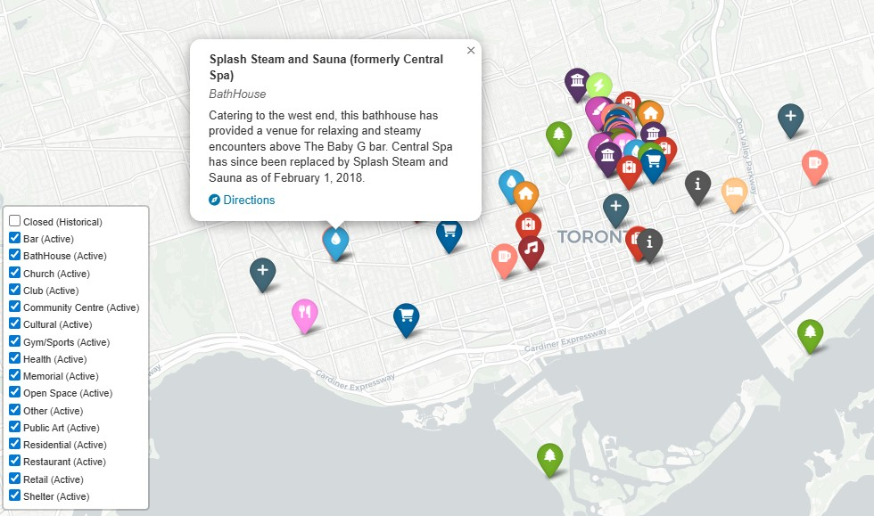

# QueerMapTO 🏳️‍🌈🇨🇦
An interactive map of active and historical queer spaces in Toronto.

## Live site
You can access the app online at: **[www.queermapto.ca](http://www.queermapto.ca)**


### Run locally
Clone the repository and install requirements:
```bash
git clone https://github.com/asvath/queermapto.git
cd queermapto
pip install -r requirements.txt
streamlit run app.py
```

## Acknowledgments & Credits

QueerMapTO builds on the [**Queer Spaces database**](https://torontosocietyofarchitects.ca/toronto-queer-spaces/) created by volunteers of the **Toronto Society of Architects (TSA)**.  

This database was made possible through the efforts of countless individuals, including Janice M., Kurtis C., Joël L., Amanda E., Cherisse T., Eric W., Kate R., Rebecca P., Ryan F., Samantha B., Simon L., and Spencer L.  

It also incorporates contributions from the wider community — over one thousand people who shared their memories as part of the **2024 Pride Street Fair map**,  and the class at the **University of Waterloo School of Architecture**, who supported the digitization of these memories.
References and source materials are credited in the TSA database. Please see the TSA site for the full bibliography.

We are deeply grateful to everyone who has helped keep Toronto’s queer spaces and histories visible and accessible.